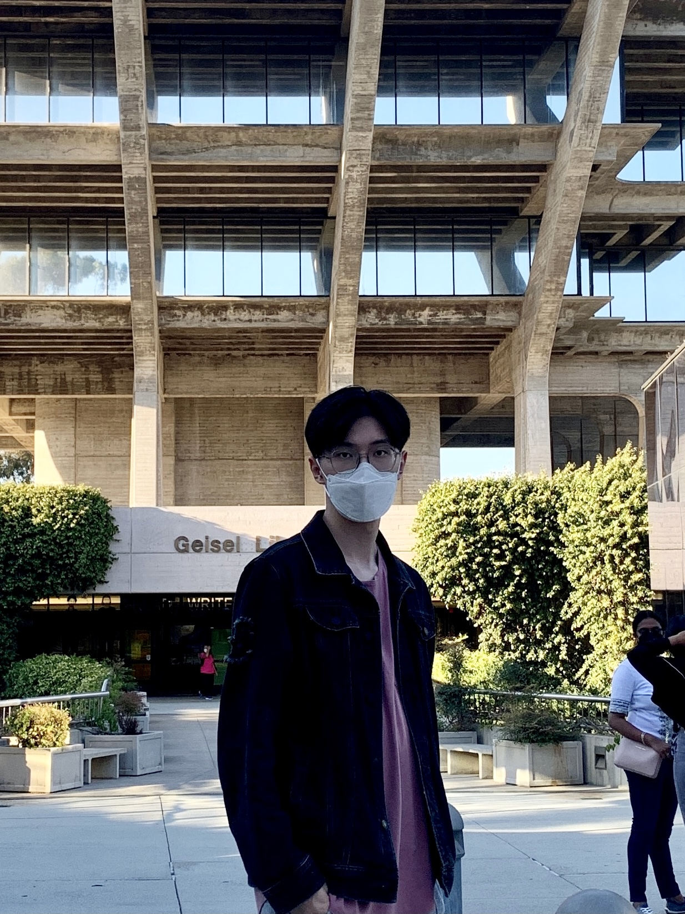

# Sizhe Fan

**Email:** sfan@ucsd.edu
**More about me:**

1. [My education experience](#education)
2. [My professional skillsets](#skill)
3. [My favourites](#favourites)
4. [My GitHub](https://github.com/chrisfan0831)

## EDUCATION

**University of California, San Diego:**

- **Major:** Cognitive Science, specialized in Machine Learning & Neural Computation
- **Minor:** Computer Science

## SKILLSET

**Programming Language:**
>
>Python
>C++
>SQL

**Tool & Package:**
>
>Sci-kit Learn
>TensorFlow
>OCI Data Science

## Favourites

**Instrument:**
>Piano
>Guitar

**Game:**
>League of Legends
>CSGO

**Sport:**
>Basketball
>Badminton

**Programming Language:**
>[README.md](README.md)

**Code:**
`import numpy as np`
